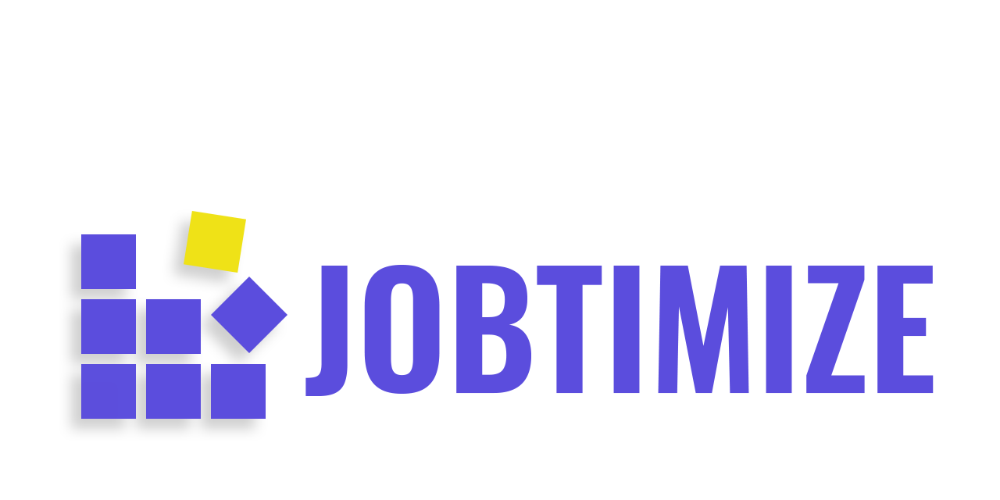

---
output:
  prettydoc::html_pretty:
    theme: architect
    highlight: vignette
    df_print: paged
    includes:
      after_body: footer.html
---


<p align="center">
  
</p>

`Jobtimize` is a python package which collects, standardizes and completes information about job offers published on job search platforms.
The package is mainly based on scraping and text classification to fill in missing data.


|Release|Usage|Development|
|---	|---  |---	      |
|[](https://pypi.org/project/Jobtimize/)|[](https://opensource.org/licenses/MIT)|[](https://travis-ci.com/Lrakotoson/Jobtimize)|
|[](https://anaconda.org/lrakotoson/jobtimize)|[](https://pypi.org/project/Jobtimize/)|[](https://codecov.io/gh/Lrakotoson/Jobtimize/)|
|[](https://github.com/Lrakotoson/Jobtimize)|   	|[](https://www.python.org/)|


<hr>
### What's new in the current version:
- [**v.0.0.4A** Changelog](https://github.com/Lrakotoson/Jobtimize/blob/master/CHANGELOG.md)
<hr>


# Dependencies
The data collected is mainly, if not entirely, obtained through the scraping of websites.  
Missing information is filled in from the complete data using a word-processing algorithm *(coming soon)*.  
Depending on the installation method, the following packages are required and will also be downloaded and installed. Otherwise, they will have to be downloaded manually.

```
beautifulsoup4
jsonschema
lxml
pandas
requests
```


# Installation
## Pypi
The safest way to install `Jobtimize` is to go through pip
```bash
pip install Jobtimize
```

## Conda
It is also possible to get the latest stable version with Anaconda Cloud
```bash
conda install -c lrakotoson jobtimize
```

## Git
The installation with git allows to have the latest version. However it can have some bugs.
```bash
pip install git+https://github.com/Lrakotoson/Jobtimize.git
```


# How to use ?
As `Jobtimize` is a package, in python you just have to import it.
The main function (*for now*) is `Jobtimize.jobscrap`.
```python
from Jobtimize import jobscrap

df = jobscrap(["Data Scientist", "Data Analyst"],
              ["UK", "FR"],
              prox = False
    )

df.head()
```
The `df` object is a dataframe pandas, so it inherits all its methods.

# Contributing 	&#x1F91D;
&#x1F38A; Firstly, thank you for giving your time to contribute to `Jobtimize`. &#x1F38A;

Contributions can only be made on the [Github repository](https://github.com/Lrakotoson/Jobtimize).

If you have a new feature to submit, don't hesitate to **open an issue** _(By checking "new feature" to make it easier to read)_ We can discuss it freely there.  
Then you can make a "pull request" as explained in the [contribution guidelines](https://github.com/Lrakotoson/Jobtimize/blob/master/docs/CONTRIBUTING.md).

Same for all contributions, code improvement, documentation writing, translations... **all ideas are welcome!** Check out the [guidelines](https://github.com/Lrakotoson/Jobtimize/blob/master/docs/CONTRIBUTING.md) to make it easier.

`Jobtimize` gets better with contributions.